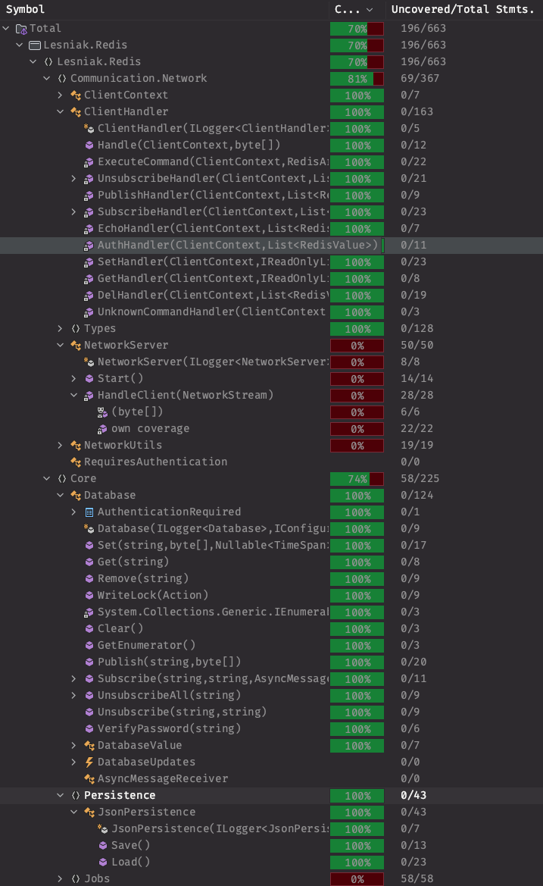
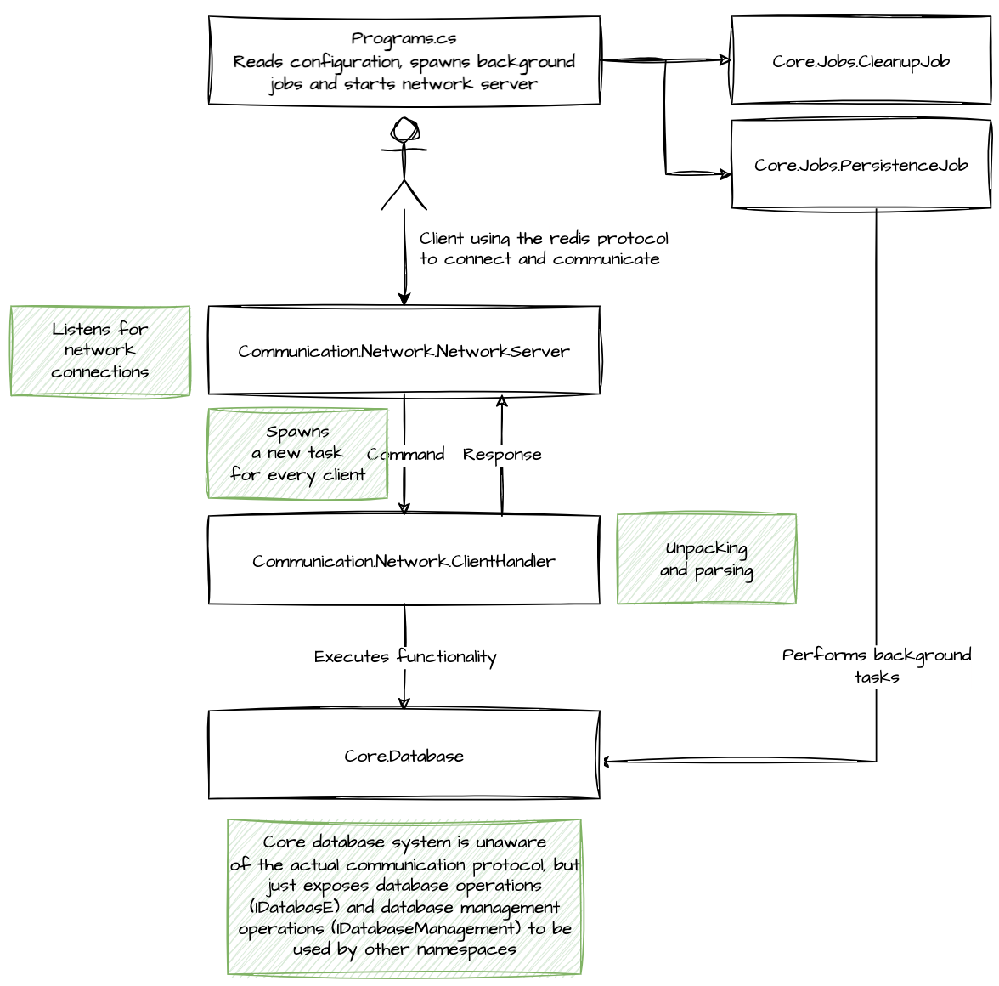

# Redis in 1024 lines of code

## Goal

Most personal pet and fun projects are too big to be finished since they have not definite end goal
in mind. This project is an attempt to create a small redis server implementation in C# with a 
clear goal and a clear end. The goal is to implement as much functionality of a redis server as 
possible in 1024 lines of C# code (according to `cloc`). Test code (in a separate module) as well as
client code (in a separate module as well) calling our server implementation will not be part of 
counting the lines.

According to `cloc` the current code base is 1015 lines of code and I therefore stopped, being
quite content what I have achieved so far:

```shell
$ cloc src
      58 text files.
      40 unique files.
     257 files ignored.

github.com/AlDanial/cloc v 1.92  T=0.04 s (903.0 files/s, 97568.7 lines/s)
-------------------------------------------------------------------------------
Language                     files          blank        comment           code
-------------------------------------------------------------------------------
JSON                            11              0              0           2962
C#                              25            186             97           1015
XML                              2              0              0             22
MSBuild script                   1              2              0             16
C# Generated                     1              4              9              9
-------------------------------------------------------------------------------
SUM:                            40            192            106           4024
-------------------------------------------------------------------------------
```

## Supported functionality

Implemented is a Redis-compatible server listening to network connections on Redis' standard port
6379 and accepting normal client connections. The server supports 

- setting, getting and removing keys, i.e. using this implementation as a key-value store
- setting key expiration times (in milliseconds and seconds)
- protecting access with the `AUTH` command
- subscribing, unsubscribing and publishing to channels
- configurability via a configuration file (`appsettings.json`)
- background jobs to store and (retrieve) the database to disk and to remove expired keys

As far as possible I tried to implement the server in a way that it is compatible with the Redis
protocol specification. This means that the server can be used with any Redis client library.
Keep in mind that I focused more on breadth than depth, i.e. I tried to implement as many commands
as possible, but not all of them in full detail. For example, the `SET` command does not support
all the options that the Redis specification defines; otherwise I might have needed the 1024 lines
of code just for this command.

## Build and run

This is a standard .NET Core project. You can build it with `dotnet build` and run it with
`dotnet run`. The server will listen on port 6379 for incoming connections. You can use any Redis
client library to connect to the server. I have tested basic functionality with the 
`StackExchange.Redis` library.

## Test concept

The test concept was two-fold: unit tests to be sure that I understood and covered the internals
of my implementation, but in addition also using an real-world client C# Redis library
(`StackExchange.Redis`).

With unit test I focused on covering correct database operations, checking for sound persistence of
the database to disk and functionally correct handling of client commands (including basic error
conditions). For these cases, which I think are the most relevant ones, I achieved a test coverage
of 100%:



By using the library I tested basic functionality like setting, getting and removing keys as well
as subscribing and publishing to channels. Given that the program based on this library worked I am
pretty confident that I covered the most important aspects of the Redis protocol:

```csharp
// From client/Program.cs

ConfigurationOptions options = new() { EndPoints = { "localhost" }, SyncTimeout = 5000, Password = "foo" };
ConnectionMultiplexer redis = ConnectionMultiplexer.Connect(options, traceWriter);

// Store and retrieve a key.
IDatabase db = redis.GetDatabase();
string key = "current";
db.StringSet(key, DateTime.UtcNow.ToString(CultureInfo.CurrentCulture));
string? value = db.StringGet(key);
Console.WriteLine($"Value: {value}");

// Publish and subscribe.
ISubscriber sub = redis.GetSubscriber();
sub.Subscribe("receiving", (channel, message) =>
{
    Console.WriteLine($"Received message: {message} on channel: {channel}");
});
while (true)
{
    await Task.Delay(TimeSpan.FromSeconds(1));
    sub.Publish("date", DateTime.UtcNow.ToString());
}
```

## Design

This repository consists of three modules:

- `src` contains the implementation of the Redis server
- `test` contains the unit tests for the server
- `client` contains a simple client that can be used to connect to the server

Since both `test` and `client` are self-explanatory I will focus on the `src` module by depicting
the overall design in the following figure:



## References

 - https://redis.io/docs/reference/protocol-spec/
 - The Redis documentation in general. It's a great resource.
 - A lot of trial and error ...
